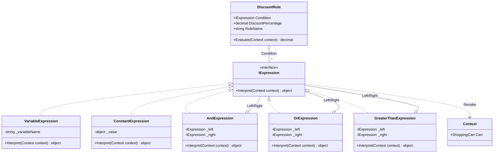

## 🥁 CarnaCode 2026 - Desafio 15 - Interpreter

Oi, eu sou o Ronaldo e este é o espaço onde compartilho minha jornada de aprendizado durante o desafio **CarnaCode 2026**, realizado pelo [balta.io](https://balta.io). 👻

Aqui você vai encontrar projetos, exercícios e códigos que estou desenvolvendo durante o desafio. O objetivo é colocar a mão na massa, testar ideias e registrar minha evolução no mundo da tecnologia.

### Sobre este desafio
No desafio **Interpreter** eu tive que resolver um problema real implementando o **Design Pattern** em questão.
Neste processo eu aprendi:
* ✅ Boas Práticas de Software
* ✅ Código Limpo
* ✅ SOLID
* ✅ Design Patterns (Padrões de Projeto)

## Problema
Um e-commerce precisa avaliar regras complexas de desconto escritas em formato texto (ex: "Se quantidade > 10 E valor > 1000 ENTÃO desconto 15%"). 
O código atual usa muitos if/else e não permite que regras sejam configuradas dinamicamente.

## Sobre o CarnaCode 2026
O desafio **CarnaCode 2026** consiste em implementar todos os 23 padrões de projeto (Design Patterns) em cenários reais. Durante os 23 desafios desta jornada, os participantes são submetidos ao aprendizado e prática na idetinficação de códigos não escaláveis e na solução de problemas utilizando padrões de mercado.

### eBook - Fundamentos dos Design Patterns
Minha principal fonte de conhecimento durante o desafio foi o eBook gratuito [Fundamentos dos Design Patterns](https://lp.balta.io/ebook-fundamentos-design-patterns).

### Veja meu progresso no desafio
[Repositório central](https://github.com/ronaldofas/balta-desafio-carnacode-2026-central)

---

## 🛠 Padrão Utilizado: Interpreter

O padrão **Interpreter** é um design pattern comportamental que define uma representação para a gramática de uma linguagem e fornece um interpretador para lidar com ela. Ele soluciona o problema da avaliação de sentenças complexas através da construção de uma Árvore de Sintaxe Abstrata (AST), combinando unidades básicas de "Expressões".

**Por que este padrão foi escolhido?**
Originalmente, o processamento de regras dependia pesadamente de métodos como `.Contains` e `.Split`, impossibilitando suporte real a precedência com parênteses, conectivos lógicos flexíveis combinados (`&&` e `||`) ou a adição simples de novos delimitadores, inviabilizando qualquer forma de criar uma DSL de verdade. O Padrão *Interpreter* soluciona isso transformando a *string* confusa em orientada a objetos (expressões que auto avaliam os nós filhos).

## 🚀 Etapas da Refatoração

Nossa refatoração ocorreu em etapas de transição seguras e iterativas:

1. **Configuração do Projeto e Ambiente Console**: Criação do novo `InterpreterPattern.csproj` targeting `.NET 10` dentro da pasta base `src/`, preservando o antigo arquivo `Challenge.cs` sob o nome `ChallengeProgram.cs`.
2. **Setup do Core do Interpreter**: Criação da interface contrato matriz `IExpression`, o qual implementará o método central `Interpret(Context)`.
3. **Ponte Contextual**: Implementação da classe `Context`, que fica responsável por carregar o estado da aplicação (neste cenário, os dados do `ShoppingCart`).
4. **Classes Terminais Primárias**: Elementos criados para realizar leituras diretas:
   - `VariableExpression` (Acessa um campo do contexto).
   - `ConstantExpression` (Uma constante imutável).
5. **Expressões Não-Terminais Relacionais**: Classes aglutinadoras de expressões terminais que aplicam lógica C# na AST.
   - `EqualsExpression` (Iguais).
   - `GreaterThanExpression` / `GreaterOrEqualExpression` (Maiores).
6. **Expressões Não-Terminais Lógicas**: Conectivos booleanos.
   - `AndExpression` (E).
   - `OrExpression` (OU).
   - `NotExpression` (NÃO).
7. **Regras de Negócio e Parser Manual**: Modelamos a `DiscountRule` que interliga a AST inteira (condição) ao resultado do e-commerce (percentual de desconto pretendido) e validamos as saídas no Console `Program.cs`.

## 📁 Estrutura de Arquivos

Toda a lógica está segregada em classes individuais limpas e coesas na pasta base `/src`:

```
📂 src/
 ┣ 📜 AndExpression.cs              (Expressão lógica E)
 ┣ 📜 Challenge.cs                  (Código legado/antigo sem padrão)
 ┣ 📜 ConstantExpression.cs         (Expressão terminal que armazena algo em memória)
 ┣ 📜 Context.cs                    (Transportador dos dados globais / carrinho de compras)
 ┣ 📜 DiscountRule.cs               (Gerenciador da avaliação da árvore)
 ┣ 📜 EqualsExpression.cs           (Expressão de igualdade sintática entre nós filhos)
 ┣ 📜 GreaterOrEqualExpression.cs   (Expressões não-terminais relacionais Maior/Igual)
 ┣ 📜 GreaterThanExpression.cs      (Expressão referencial Maior Que)
 ┣ 📜 IExpression.cs                (Interface que força todo nó implementar 'Interpret()')
 ┣ 📜 InterpreterPattern.csproj     (Ponto focal C# 10)
 ┣ 📜 NotExpression.cs              (Expressão unária de negação)
 ┣ 📜 OrExpression.cs               (Expressão ramificada para condicional OU)
 ┣ 📜 Program.cs                    (Comparativo e criador de DSL / Árvores manuais)
 ┗ 📜 VariableExpression.cs         (Roteamento dinâmico que transcreve dados do Contexto)
```

## 🏗 Diagrama de Classes

Abaixo um fluxograma representando como a inversão de árvore e hierarquia do padrão atua no nosso código C# 10 refatorado:


